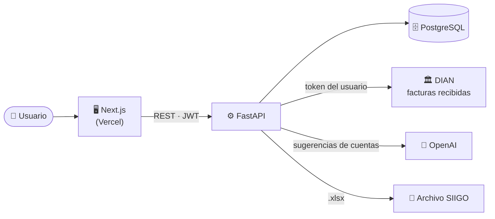
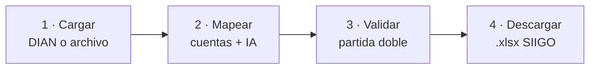

<div align="center">

<picture>
  <source media="(prefers-color-scheme: dark)" srcset="frontend/public/brand/Logo-blanco.webp">
  
</picture>

### Automatiza tu causación contable en segundos

Plataforma que lee facturas electrónicas de la **DIAN**, sugiere las cuentas contables con **IA**
y genera el archivo de importación para **SIIGO** — sin digitación manual.

<br>


</div>

---

## 📖 ¿Qué es Ciolix?

**Ciolix** convierte el proceso manual de causación de compras en un flujo automático:

1. **Trae** las facturas recibidas directo de la DIAN (con el token del usuario) o cárgalas como archivo (`.xml`, `.zip`, `.pdf` o Excel del portal DIAN).
2. **Mapea** cada ítem a su cuenta del PUC — con sugerencias de **IA**, reglas y aprendizaje del historial.
3. **Valida** la partida doble antes de generar nada.
4. **Descarga** el archivo `.xlsx` listo para importar a **SIIGO**.

Cada cliente trabaja en su propia empresa aislada (multi-tenant): todo dato viaja por `empresa_id`.

---

## ✨ Características

| | |
|---|---|
| 🧾 **Causación de compras** | Lee facturas DIAN y arma los comprobantes contables automáticamente. |
| ➖ **Notas crédito (NC)** | Submódulo dedicado: detecta las NC en un lote de compras y las rutea solo, con partida invertida. |
| 🤖 **Sugerencias con IA** | OpenAI + reglas + aprendizaje del historial proponen la cuenta de cada ítem. |
| 🔗 **Integración DIAN** | Trae facturas recibidas por token, o carga manual de XML / ZIP / PDF / Excel. |
| 📚 **Catálogos** | Impuestos, Plan Único de Cuentas (PUC) y tipos de comprobante, cargables desde Excel. |
| 👥 **Terceros** | Gestión de proveedores y vendedores. |
| 🧮 **Impuestos correctos** | IVA, Retefuente (%), **ReteICA por mil**, ReteIVA — con partida doble balanceada. |
| 📤 **Exportación SIIGO** | Genera el `.xlsx` con el formato exacto del modelo de importación. |
| 🔐 **Autenticación** | JWT, verificación de correo y recuperación de contraseña. |
| 🕓 **Historial** | Todas las facturas causadas, consultables por empresa. |

---

## 🧱 Stack tecnológico

| Capa | Tecnologías |
|------|-------------|
| **Frontend** | Next.js 16 (Turbopack) · React 19 · TypeScript 5 · TailwindCSS 4 · Zustand · TanStack Query · lucide-react |
| **Backend** | FastAPI · Python 3.11 · SQLAlchemy 2.0 · Alembic · Pydantic 2 · Uvicorn |
| **Base de datos** | PostgreSQL 16 |
| **IA** | OpenAI |
| **Procesamiento** | pandas · openpyxl · xlsxwriter · pypdf · pdfplumber · BeautifulSoup |
| **Infra** | Docker · Docker Compose · Portainer (VPS) · Apache (reverse proxy) · Vercel |
| **Observabilidad** | Sentry / GlitchTip |

---

## 🏗️ Arquitectura



### Flujo de causación



---

## 📁 Estructura del proyecto

```
Smart-causation/
├── api/            # Routers y esquemas FastAPI (auth, causación, dian, catálogos…)
├── core/           # Parser de facturas DIAN + exportador SIIGO
├── db/             # Modelos SQLAlchemy
├── services/       # Lógica de negocio (causación, IA, DIAN, aprendizaje…)
├── alembic/        # Migraciones de base de datos
├── scripts/        # Utilidades (ej. carga de geografía)
├── frontend/       # Aplicación Next.js
│   └── src/app/    # Rutas: causacion, causacion-nc, catalogos, historial, terceros…
├── docs/           # Documentación
├── docker-compose.yml            # Stack de desarrollo (postgres + api + frontend)
└── docker-compose.hostinger.yml  # Stack de producción (VPS con Apache)
```

---

## 🚀 Puesta en marcha (Docker)

### Requisitos
- [Docker](https://www.docker.com/) y Docker Compose

### Arranque

```bash
# 1. Clonar
git clone https://github.com/EHM2396/smart-causation.git
cd smart-causation

# 2. (Opcional) crear un .env para las claves de IA / correo
#    Sin él, el stack levanta igual con valores por defecto.

# 3. Levantar todo
docker compose up -d
```

Esto arranca:

| Servicio | URL | Descripción |
|----------|-----|-------------|
| 🖥️ Frontend | http://localhost:3000 | Aplicación Next.js |
| ⚙️ API | http://localhost:8000 | FastAPI |
| 📘 API Docs | http://localhost:8000/docs | Swagger UI (OpenAPI) |
| 🗄️ PostgreSQL | localhost:5432 | Base de datos |

Las **migraciones se aplican solas** al arrancar la API y siembran los catálogos base y un usuario demo para desarrollo local:

```
📧 admin@smartcausacion.com   🔑 Admin2024!
```
> Solo para local. En producción usa credenciales propias.

---

## 🔑 Variables de entorno

Se configuran en un `.env` (raíz) o en las variables del stack. Las principales:

| Variable | Descripción |
|----------|-------------|
| `DATABASE_URL` | Cadena de conexión a PostgreSQL |
| `JWT_SECRET_KEY` | Secreto para firmar los tokens JWT |
| `OPENAI_API_KEY` | Clave de OpenAI (sugerencias con IA) |
| `FRONTEND_URL` | URL del frontend (enlaces de correo) |
| `MAIL_*` | Configuración SMTP (verificación / recuperación) |
| `GLITCHTIP_DSN` | DSN de reporte de errores (opcional) |
| `NEXT_PUBLIC_API_URL` | URL de la API que consume el frontend |

> Nunca subas tu `.env` al repositorio.

---

## 🗃️ Migraciones (Alembic)

```bash
# Aplicar todas las migraciones
docker compose exec api alembic upgrade head

# Crear una nueva migración
docker compose exec api alembic revision -m "descripcion del cambio"
```

En desarrollo y producción las migraciones se ejecutan automáticamente al iniciar la API.

---

## ☁️ Despliegue

| Componente | Dónde |
|------------|-------|
| **Frontend** | Vercel — despliega automáticamente al hacer push a `main`. |
| **Backend + BD** | VPS con **Docker + Portainer**, detrás de **Apache** (reverse proxy + HTTPS). Redeploy manual: *Pull and redeploy* (con rebuild de imagen). |

---

## 📄 Propiedad

Software propietario de **Ciolix**. Todos los derechos reservados.
Este repositorio y su contenido no son de uso público.

<div align="center">

<br>

**Hecho con ❤️ para simplificar la contabilidad colombiana**

</div>
